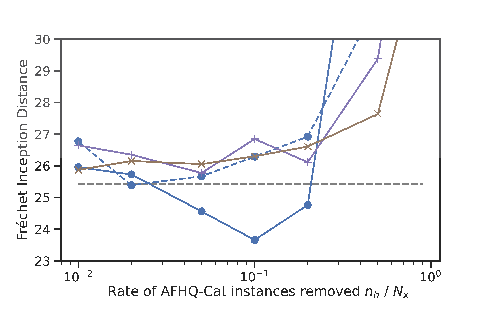
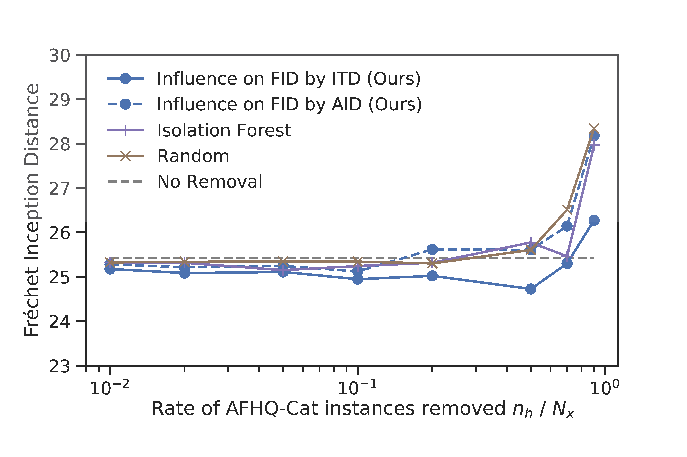
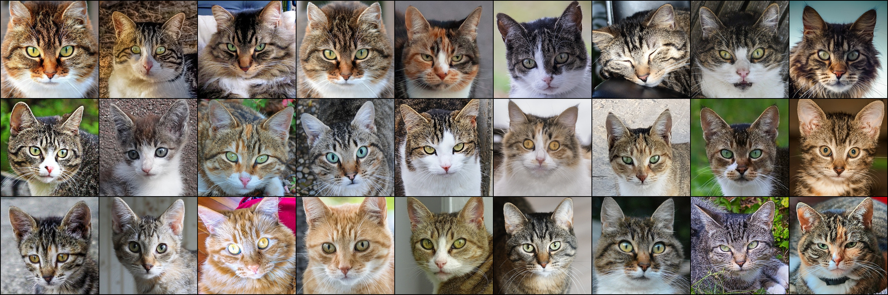
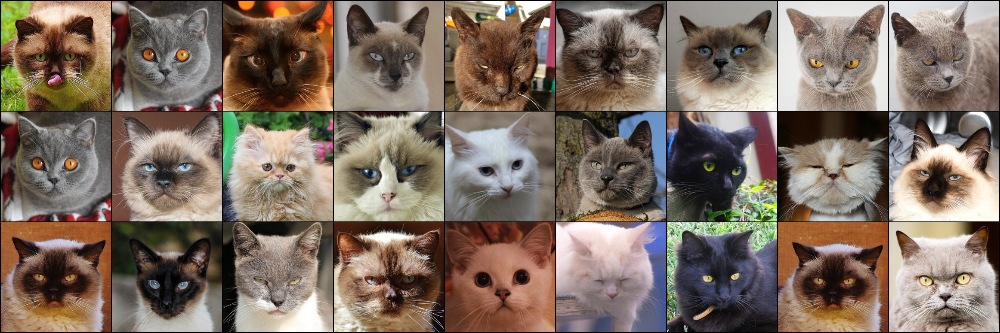

# Data Cleansing for GANs – Official Implementation

This repository provides the official implementation for **Section VI.C. Experiment 2: Data Cleansing** of the following paper.
> **Data Cleansing for GANs**  
> Naoyuki Terashita, Hiroki Ohashi, Satoshi Hara  
> *IEEE Transactions on Neural Networks and Learning Systems (TNNLS), 2025*  
> [IEEE Xplore](https://ieeexplore.ieee.org/document/10857591) | [arXiv](https://arxiv.org/abs/2504.00603)


## Cleansing of AFHQ-CAT Dataset for StyleGAN Training

The experiment evaluates the influence of training instances when fine-tuning StyleGAN (pre-trained on Flickr-Faces-HQ) to generate cat faces from the **AFHQ-CAT** (Animal Faces-HQ, cat category) dataset. We train LoRA parameters for both the generator and the discriminator and use **FID** (with Inception-V3 features) for influence estimation and evaluation. The implementation uses a practical ITD-influence estimator compatible with moving-average generator and momentum-based optimizers (e.g., Adam), as described in the paper.

### Pipeline (5 steps)

1. **Preparing datasets** – AFHQ-CAT is split into training and validation sets for AGD (adversarial gradient descent) and for computing influence / FID.
2. **Scoring harmfulness** – Harmfulness of each training instance is scored using our methods (ITD or AID influence on FID) or baselines (Isolation Forest, random).
3. **Selecting instances to remove** – Top \(n_h\) harmful instances are selected according to the chosen removal rates.
4. **Retraining** – The model is retrained with the selected instances excluded. Two strategies are supported: **full-epoch retraining** (counterfactual AGD from the initial parameters) and **one-epoch retraining** (from one epoch before the final step).
5. **Evaluation** – Retrained models are evaluated by FID on the test set.

### Setup

#### 1. Installation

Create a virtual environment (optional but recommended), then install dependencies:

```bash
pip install -r requirements.txt
```


#### 2. Download AFHQ dataset

```bash
bash download_dataset.sh
```

#### 3. Download pre-trained StyleGAN checkpoint

1. Download `stylegan-256px-new.model` from [Google Drive](https://drive.google.com/file/d/1QlXFPIOFzsJyjZ1AtfpnVhqW4Z0r8GLZ/view).
2. Place `stylegan-256px-new.model` in the `./checkpoint` directory.

### Running experiments

```bash
source venv/bin/activate
# ITD influence (FID): full-epoch and one-epoch retraining
python main.py PipelineCleansing --method-influence itd --name-metric-infl fid --scales [0.01,0.001] --on-averaged-G --mixing --local-scheduler
# AID influence (FID)
python main.py PipelineCleansing --method-influence aid --depth 1000 --scales [0.001,0.001] --on-averaged-G --mixing --local-scheduler
# Baseline – Isolation Forest
python main.py PipelineCleansing --name-metric-infl isolation_forest --scales [0.01,0.001] --on-averaged-G --mixing --local-scheduler
# Baseline – Random
python main.py PipelineCleansing --name-metric-infl random --scales [0.001,0.001] --on-averaged-G --mixing --local-scheduler
```
### Expected results

After completing the above commands, you can visualize the results in the [Jupyter notebooks](./notebook). Below are the expected are the expected outcomes from the paper.

**Test FID vs. data removal rate.** 

| Full-epoch retraining | One-epoch retraining |
|-----------------------|----------------------|
|  |  |

**Influential training instances.** Top-27 harmful and helpful instances from ITD (over entire training steps), and randomly selected instances.

| Harmful instances | Helpful instances | 
|-------------------|-------------------|
|  |  | 

**Generated images before and after data cleansing.** For each method, the model with the best validation FID is used. For every method, we chose the model that yielded the best validation FID. Each row uses the same test latent.

<table>
<tr>
<td width="20%" align="center"><strong>No removal</strong><br></td>
<td width="20%" align="center"><strong>Infl. on FID by ITD</strong><br></td>
<td width="20%" align="center"><strong>Infl. on FID by AID</strong><br></td>
<td width="20%" align="center"><strong>Isolation Forest</strong><br></td>
<td width="20%" align="center"><strong>Random</strong><br></td>
</tr>
</table>


## Citation

If you find our work useful, please consider citing:

```bibtex
@ARTICLE{10857591,
  author={Terashita, Naoyuki and Ohashi, Hiroki and Hara, Satoshi},
  journal={IEEE Transactions on Neural Networks and Learning Systems},
  title={Data Cleansing for GANs},
  year={2025},
  volume={36},
  number={6},
  pages={11575-11588},
  doi={10.1109/TNNLS.2025.3529540}}
```
